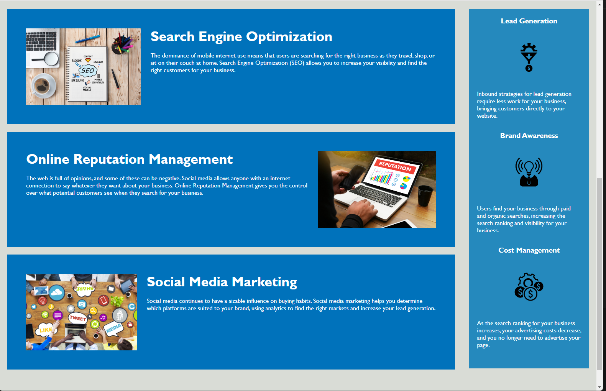

# Challenge-1 Horiseon Social Solutions

This is a website that contains some basic company overview information. 
For the assignment I took the provided code and changed some of the HTML to semantic HTML and consolidated some of the CSS stylesheet to make everything more concise and easier to follow.

## Deployed page link

https://cdziedzic.github.io/Horiseon/

## Screenshot of page 

